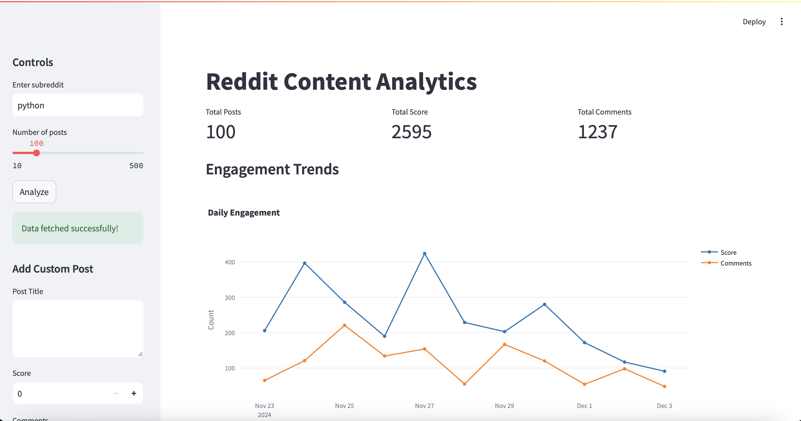
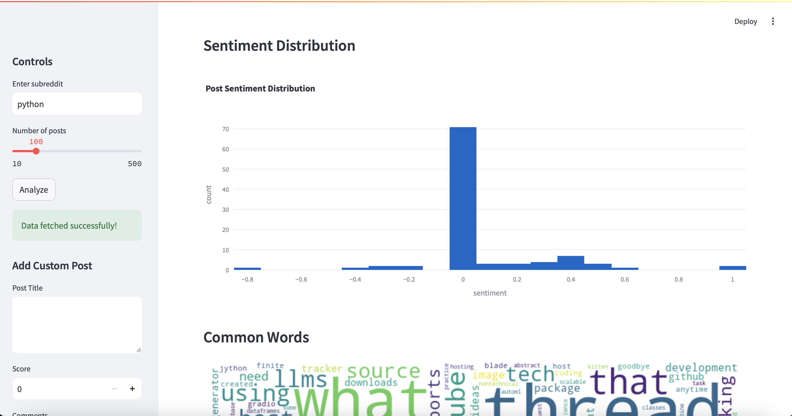
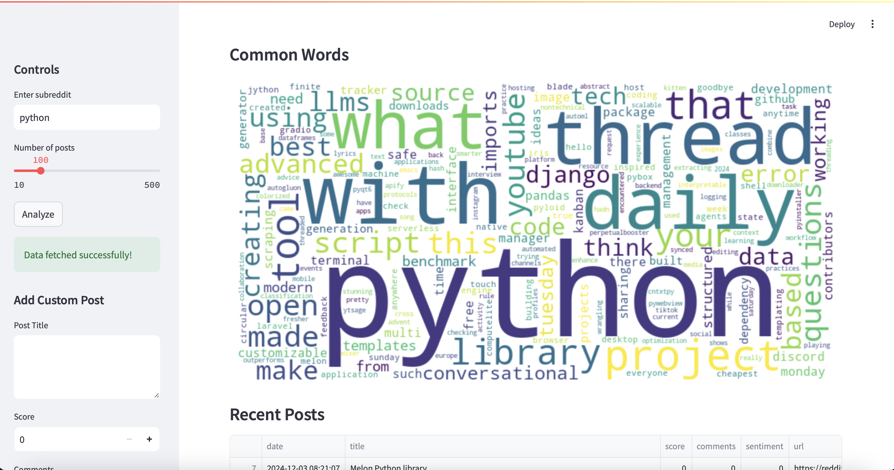
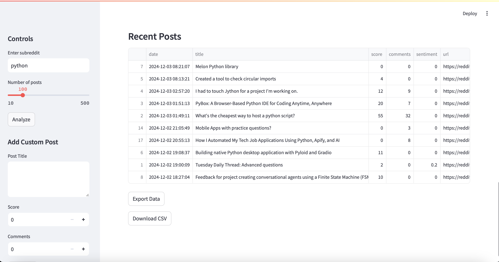
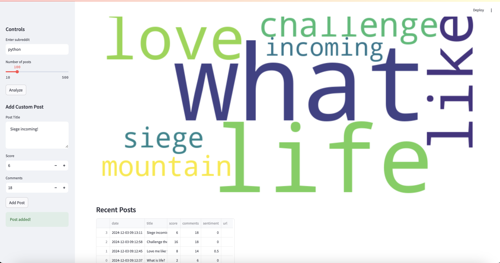

Welcome to Social Media Analyzer! Check it out .

This project scrapes up to 500 posts from any subreddit and shows the total score, total comments, and an engagement chart,

 sentiment distribution,

 
 
 a wordcloud of the most common terms,
 
 

 and some of the most recent posts (and their analysis), with the ability to export as a CSV file!

Feel free to add and analyze your own posts, too!

